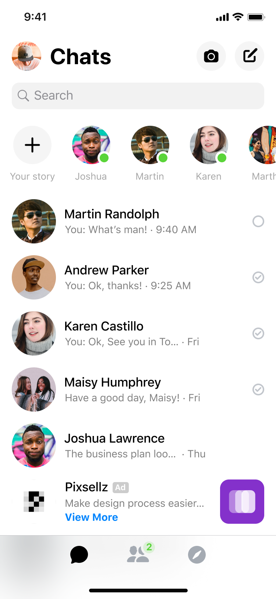

# Social Media App Demos
Social media apps are a great place to start when learning to write mobile apps. You can imitate existing apps to start your learning journey. 

This repository contains multiple social media application demos, such as facebook messenger/twitter(x)/telegram. You can start your learning here.

## messenger  
### chats

<!--    -->

### discover

<!--  -->  

## telegram  

### calls
<!--  -->   

## SnapChat

### profile

---
All demo source code is automatically generated using the Figma plugin provided by Codia-AI. If you have more code conversion needs, you can visit [Codia-AI Figma to code](https://www.figma.com/community/plugin/1301565000406306598).

Codia-AI converts figma designs to Production-Ready Code within minutes for Web and App like humans

- Key Attraction: AI-Powered, Speed, precision, multi-platform support

- Supported Platforms:

  - Web/H5: A rich set of technologies including HTML, CSS, JavaScript, TypeScript, Tailwind, React, Vue, with ongoing expansions.

  - Apps: Broad coverage across iOS, Android, Flutter, Swift, SwiftUI, Objective-C, Java, Kotlin, ensuring continuous updates.

You can find more information on our website [Codia-AI](https://codia.ai/).